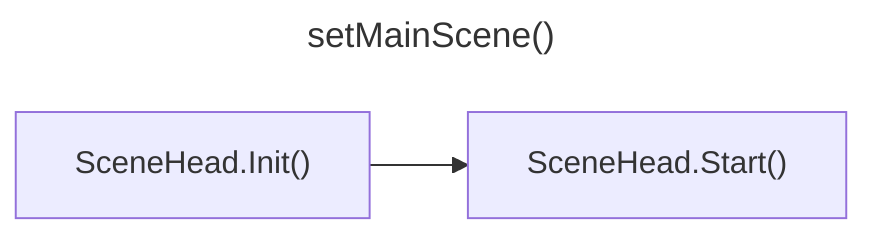
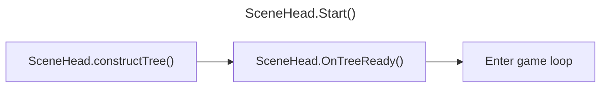
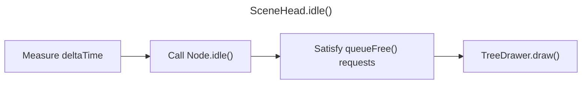

# What Happens Inside the Engine?
All you need for the engine to start your game is call ```initEngine()``` and ```setMainScene()``` and it will immediately start. ```initEngine()``` is very short and not much happens there so we'll look at ```setMainScene()```.  

## `setMainScene()`

Here we call ```SceneHead.Init()``` and pass a pointer to the input and physics servers. This method calls all the ```glut*Func()``` functions to connect the scenehead to the callback functions generated by OpenGL. It also creates a ```TreeDrawer```, enables depth testing and sets the background color.  

Next we call `SceneHead.Start()` which calls `constructTree()` (which you hopefully overrided in your custom `SceneHead` class), then `onTreeReady()` which recursively calls `ready()` on every node in the scene tree from leaves to the root. Lastly we call `glutMainLoop()` which enters the game loop.

## `SceneHead.idle()`

Here is where most of the complex work happens so strap in.  
First we calculate the time since the last idle was called (how much time has passed since the last frame) then call `idle()` recursively on all nodes in the tree.  
Next we search the tree for any nodes that requested to be freed and we delete them and their children from the scene.  
Next we call `glutPostRedisplay()` which invokes `SceneHead.draw()`. Drawing the tree is delegated to `TreeDrawer.drawScene()`
 