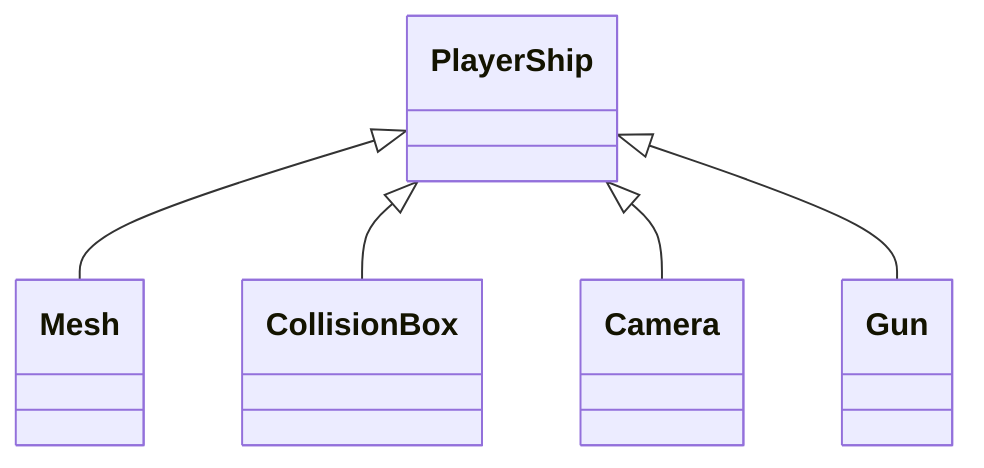
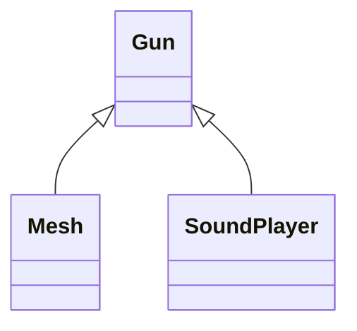

# How to Use This Engine

## initEngine() and setMainScene()
Call initEngine() to initiate the engine for use. This functions starts up openGL and creates singletons that are needed for any game.
Call setMainScene() with a pointer to a ```SceneHead``` instance that represent the entry scene of your game.

## What is SceneHead?
SceneHead is a base class that is responsible for managing your scene tree. It calls the idle(), draw(), input() functions of every node in the tree and communicates with InputServer and PhysicsServer for running input and physics calculations every frame.
When you want to create a scene for your game, write a new class that extends SceneHead and creates all the nodes of the scene tree in its constructor. You need to set the ```scene_root``` variable for it to work.

## Nodes
Every game scene is composed of a tree of nodes. The engine provides a few types of nodes to help you make a game.  
The benefit of constructing a scene as a tree is that it allows a complicated object to be broken into several related simple objects. For example: a player spaceship needs to have a model/mesh, a collision box, a camera that follows it, and a gun that shoots bullets. You can construct the tree of the player character like this:

The gun itself can be a tree:  


Now we look at the types of nodes:
### Node
This is most basic and all other node classes inherit from it. All this class has is methods for adding and removing it from a tree and variables for storing its children and parent. All nodes have a reference to the SceneHead.

### Node3D : Node
The base node class for making a 3D object. All 3D classes inherit this class. Stores position, rotation, and scale information to be used when drawing this object and its children.

### PhysicsBody3D : Node3D
The most basic class that can be involved in ```PhysicsServer``` calculations. Needs to have a ```CollisionBox3D``` as a child to work properly. Used for collision detection but not for movement. Has variables for collision layer and collision mask.

### KenimaticBody3D : PhysicsBody3D
Stores a velocity variable to be used by the ```PhysicsServer``` to move it. Can collide with other ```PhyiscsBody3D``` objects and reacts appropriately.

### CollisionBox3D : Node3D
A simple collider in the shape of a box. Can specify width, length, and height. Cannot rotate for now to make collision detection simple. 

### Camera3D : Node3D
A class for specifying the position and orientation of the camera in the world. ```SceneHead``` will look for an instance of this class in the tree to know where to place the viewing area. If no cameras exist in the scene then the viewing area will be default to ```glFrustem(-100, 100, -100, 100, 20, 500)``` and ```gluLookAt(0,0,0, 0,0,-1, 0,1,0)```.

