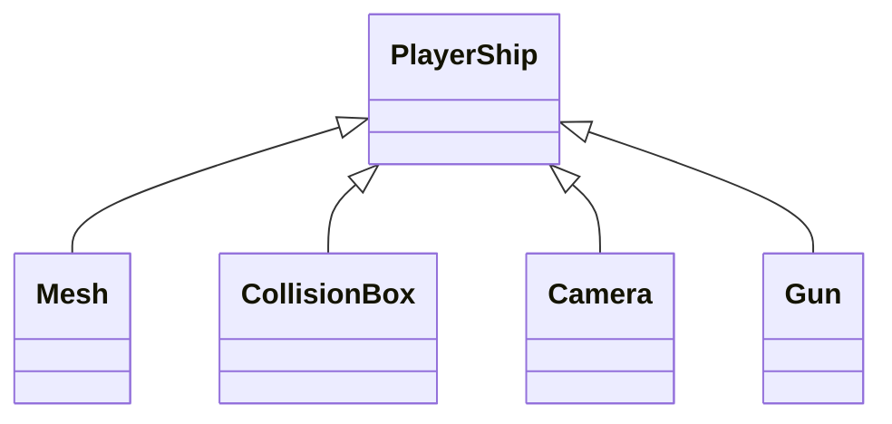
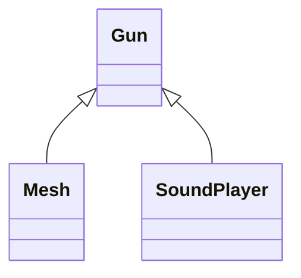

# How to Use This Engine

## ```initEngine()``` and ```setMainScene()```
In ```main()``` call initEngine() to initiate the engine for use. This functions starts up openGL and creates singletons that are needed for any game.
Call `setMainScene()` with a pointer to a ```SceneHead``` instance that represent the entry scene of your game.

## What is ```SceneHead```?
SceneHead is a base class that is responsible for managing your scene tree. It calls the ```ready()```, ```idle()``` functions of every node in the tree and communicates with `InputServer` and `PhysicsServer` for running input and physics calculations every frame.
When you want to create a scene for your game, write a new class that extends SceneHead and overrides ```costructTree()``` to create all the nodes in the game scene and return the root node.

## Scene Tree and Nodes
Every game scene is composed of a tree of nodes. The engine provides a few types of nodes to help you make a game.  
The benefit of constructing a scene as a tree is that it allows a complicated object to be broken into several related simple objects. For example: a player spaceship needs to have a model/mesh, a collision box, a camera that follows it, and a gun that shoots bullets. You can construct the tree of the player character like this:

The gun itself can be a tree:  


Go to **Nodes.md** to see a description of all node types.

